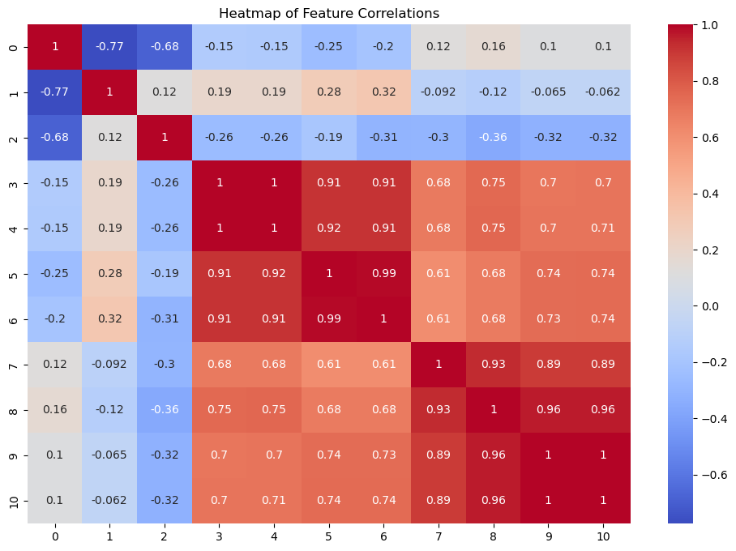
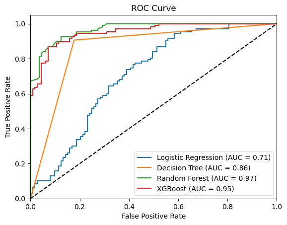

**Project Documentation**: Using Dental Metrics to Predict Gender

**Objective**:
The goal of this project is to predict the gender (male or female) of individuals using dental metrics such as inter-canine distances and other oral measurements. We will use various machine learning algorithms and evaluate their performance to choose the best model.


```python
pip install xgboost
```

    Requirement already satisfied: xgboost in c:\users\dell\anaconda3\lib\site-packages (2.1.1)Note: you may need to restart the kernel to use updated packages.
    
    Requirement already satisfied: numpy in c:\users\dell\anaconda3\lib\site-packages (from xgboost) (1.26.4)
    Requirement already satisfied: scipy in c:\users\dell\anaconda3\lib\site-packages (from xgboost) (1.13.1)
    

**Step 1: Importing Necessary Libraries**


```python
# As problem falls into classification machine learning lets import required libraries
# For data manipulation and analysis
import pandas as pd
import numpy as np

# For data visualization
import matplotlib.pyplot as plt
import seaborn as sns

# For splitting the data
from sklearn.model_selection import train_test_split
from sklearn.preprocessing import LabelEncoder, Normalizer

# For building classification models
from sklearn.linear_model import LogisticRegression
from sklearn.tree import DecisionTreeClassifier
from sklearn.ensemble import RandomForestClassifier
from xgboost import XGBClassifier

# For model evaluation metrics
from sklearn.metrics import accuracy_score, classification_report, confusion_matrix, roc_curve, auc

# For scaling data (if needed)
from sklearn.preprocessing import StandardScaler

# For handling imbalanced data (if applicable)
from imblearn.over_sampling import SMOTE
```

**Step 2: Import the Dataset**


```python
# importing the dataset
df = pd.read_csv("Dentistry Dataset.csv")
```


```python
# Loading the dataset
df.head()
```


<div>
<style scoped>
    .dataframe tbody tr th:only-of-type {
        vertical-align: middle;
    }

    .dataframe tbody tr th {
        vertical-align: top;
    }

    .dataframe thead th {
        text-align: right;
    }
</style>
<table border="1" class="dataframe">
  <thead>
    <tr style="text-align: right;">
      <th></th>
      <th>Sl No</th>
      <th>Sample ID</th>
      <th>Age</th>
      <th>Gender</th>
      <th>inter canine distance intraoral</th>
      <th>intercanine distance casts</th>
      <th>right canine width intraoral</th>
      <th>right canine width casts</th>
      <th>left canine width intraoral</th>
      <th>left canine width casts</th>
      <th>right canine index intra oral</th>
      <th>right canine index casts</th>
      <th>left canine index intraoral</th>
      <th>left canine index casts</th>
    </tr>
  </thead>
  <tbody>
    <tr>
      <th>0</th>
      <td>1</td>
      <td>NaN</td>
      <td>24</td>
      <td>Female</td>
      <td>25.06</td>
      <td>25.05</td>
      <td>6.08</td>
      <td>6.08</td>
      <td>6.09</td>
      <td>6.10</td>
      <td>0.242</td>
      <td>0.242</td>
      <td>0.242</td>
      <td>0.241</td>
    </tr>
    <tr>
      <th>1</th>
      <td>2</td>
      <td>NaN</td>
      <td>22</td>
      <td>Female</td>
      <td>25.78</td>
      <td>25.79</td>
      <td>6.13</td>
      <td>6.13</td>
      <td>6.33</td>
      <td>6.33</td>
      <td>0.237</td>
      <td>0.237</td>
      <td>0.247</td>
      <td>0.247</td>
    </tr>
    <tr>
      <th>2</th>
      <td>3</td>
      <td>NaN</td>
      <td>23</td>
      <td>Female</td>
      <td>23.83</td>
      <td>23.83</td>
      <td>5.91</td>
      <td>5.96</td>
      <td>6.28</td>
      <td>6.28</td>
      <td>0.248</td>
      <td>0.248</td>
      <td>0.264</td>
      <td>0.264</td>
    </tr>
    <tr>
      <th>3</th>
      <td>4</td>
      <td>NaN</td>
      <td>20</td>
      <td>Female</td>
      <td>26.12</td>
      <td>26.12</td>
      <td>6.08</td>
      <td>6.08</td>
      <td>6.56</td>
      <td>6.56</td>
      <td>0.232</td>
      <td>0.232</td>
      <td>0.250</td>
      <td>0.250</td>
    </tr>
    <tr>
      <th>4</th>
      <td>5</td>
      <td>NaN</td>
      <td>20</td>
      <td>Female</td>
      <td>26.36</td>
      <td>26.41</td>
      <td>6.09</td>
      <td>6.09</td>
      <td>6.50</td>
      <td>6.50</td>
      <td>0.231</td>
      <td>0.231</td>
      <td>0.246</td>
      <td>0.246</td>
    </tr>
  </tbody>
</table>
</div>


**Step 3: Data Preprocessing**


```python
# checking shape of dataset
df.shape
```


    (1100, 14)


```python
# Checking dataset info
df.info()
```

    <class 'pandas.core.frame.DataFrame'>
    RangeIndex: 1100 entries, 0 to 1099
    Data columns (total 14 columns):
     #   Column                           Non-Null Count  Dtype  
    ---  ------                           --------------  -----  
     0   Sl No                            1100 non-null   int64  
     1   Sample ID                        0 non-null      float64
     2   Age                              1100 non-null   int64  
     3   Gender                           1100 non-null   object 
     4   inter canine distance intraoral  1100 non-null   float64
     5   intercanine distance casts       1100 non-null   float64
     6   right canine width intraoral     1100 non-null   float64
     7   right canine width casts         1100 non-null   float64
     8   left canine width intraoral      1100 non-null   float64
     9   left canine width casts          1100 non-null   float64
     10  right canine index intra oral    1100 non-null   float64
     11  right canine index casts         1100 non-null   float64
     12  left canine index intraoral      1100 non-null   float64
     13  left canine index casts          1100 non-null   float64
    dtypes: float64(11), int64(2), object(1)
    memory usage: 120.4+ KB
    


```python
# Checking for missing values
df.isnull().sum()
```


    Sl No                                 0
    Sample ID                          1100
    Age                                   0
    Gender                                0
    inter canine distance intraoral       0
    intercanine distance casts            0
    right canine width intraoral          0
    right canine width casts              0
    left canine width intraoral           0
    left canine width casts               0
    right canine index intra oral         0
    right canine index casts              0
    left canine index intraoral           0
    left canine index casts               0
    dtype: int64


```python
# Lets drop the column sample id as all value are missing
# Dropping the 'SampleID' column from the dataframe
df = df.drop('Sample ID', axis=1)

# Display the first few rows to confirm the column is dropped
df.head()
```


<div>
<style scoped>
    .dataframe tbody tr th:only-of-type {
        vertical-align: middle;
    }

    .dataframe tbody tr th {
        vertical-align: top;
    }

    .dataframe thead th {
        text-align: right;
    }
</style>
<table border="1" class="dataframe">
  <thead>
    <tr style="text-align: right;">
      <th></th>
      <th>Sl No</th>
      <th>Age</th>
      <th>Gender</th>
      <th>inter canine distance intraoral</th>
      <th>intercanine distance casts</th>
      <th>right canine width intraoral</th>
      <th>right canine width casts</th>
      <th>left canine width intraoral</th>
      <th>left canine width casts</th>
      <th>right canine index intra oral</th>
      <th>right canine index casts</th>
      <th>left canine index intraoral</th>
      <th>left canine index casts</th>
    </tr>
  </thead>
  <tbody>
    <tr>
      <th>0</th>
      <td>1</td>
      <td>24</td>
      <td>Female</td>
      <td>25.06</td>
      <td>25.05</td>
      <td>6.08</td>
      <td>6.08</td>
      <td>6.09</td>
      <td>6.10</td>
      <td>0.242</td>
      <td>0.242</td>
      <td>0.242</td>
      <td>0.241</td>
    </tr>
    <tr>
      <th>1</th>
      <td>2</td>
      <td>22</td>
      <td>Female</td>
      <td>25.78</td>
      <td>25.79</td>
      <td>6.13</td>
      <td>6.13</td>
      <td>6.33</td>
      <td>6.33</td>
      <td>0.237</td>
      <td>0.237</td>
      <td>0.247</td>
      <td>0.247</td>
    </tr>
    <tr>
      <th>2</th>
      <td>3</td>
      <td>23</td>
      <td>Female</td>
      <td>23.83</td>
      <td>23.83</td>
      <td>5.91</td>
      <td>5.96</td>
      <td>6.28</td>
      <td>6.28</td>
      <td>0.248</td>
      <td>0.248</td>
      <td>0.264</td>
      <td>0.264</td>
    </tr>
    <tr>
      <th>3</th>
      <td>4</td>
      <td>20</td>
      <td>Female</td>
      <td>26.12</td>
      <td>26.12</td>
      <td>6.08</td>
      <td>6.08</td>
      <td>6.56</td>
      <td>6.56</td>
      <td>0.232</td>
      <td>0.232</td>
      <td>0.250</td>
      <td>0.250</td>
    </tr>
    <tr>
      <th>4</th>
      <td>5</td>
      <td>20</td>
      <td>Female</td>
      <td>26.36</td>
      <td>26.41</td>
      <td>6.09</td>
      <td>6.09</td>
      <td>6.50</td>
      <td>6.50</td>
      <td>0.231</td>
      <td>0.231</td>
      <td>0.246</td>
      <td>0.246</td>
    </tr>
  </tbody>
</table>
</div>


```python
#Since the target variable "Gender" is categorical, we need to encode it.
# Encoding 'Gender' (the target variable)
label_encoder = LabelEncoder()
df['Gender'] = label_encoder.fit_transform(df['Gender'])  # 0 for female, 1 for male
```


```python
df.head()
```


<div>
<style scoped>
    .dataframe tbody tr th:only-of-type {
        vertical-align: middle;
    }

    .dataframe tbody tr th {
        vertical-align: top;
    }

    .dataframe thead th {
        text-align: right;
    }
</style>
<table border="1" class="dataframe">
  <thead>
    <tr style="text-align: right;">
      <th></th>
      <th>Sl No</th>
      <th>Age</th>
      <th>Gender</th>
      <th>inter canine distance intraoral</th>
      <th>intercanine distance casts</th>
      <th>right canine width intraoral</th>
      <th>right canine width casts</th>
      <th>left canine width intraoral</th>
      <th>left canine width casts</th>
      <th>right canine index intra oral</th>
      <th>right canine index casts</th>
      <th>left canine index intraoral</th>
      <th>left canine index casts</th>
    </tr>
  </thead>
  <tbody>
    <tr>
      <th>0</th>
      <td>1</td>
      <td>24</td>
      <td>0</td>
      <td>25.06</td>
      <td>25.05</td>
      <td>6.08</td>
      <td>6.08</td>
      <td>6.09</td>
      <td>6.10</td>
      <td>0.242</td>
      <td>0.242</td>
      <td>0.242</td>
      <td>0.241</td>
    </tr>
    <tr>
      <th>1</th>
      <td>2</td>
      <td>22</td>
      <td>0</td>
      <td>25.78</td>
      <td>25.79</td>
      <td>6.13</td>
      <td>6.13</td>
      <td>6.33</td>
      <td>6.33</td>
      <td>0.237</td>
      <td>0.237</td>
      <td>0.247</td>
      <td>0.247</td>
    </tr>
    <tr>
      <th>2</th>
      <td>3</td>
      <td>23</td>
      <td>0</td>
      <td>23.83</td>
      <td>23.83</td>
      <td>5.91</td>
      <td>5.96</td>
      <td>6.28</td>
      <td>6.28</td>
      <td>0.248</td>
      <td>0.248</td>
      <td>0.264</td>
      <td>0.264</td>
    </tr>
    <tr>
      <th>3</th>
      <td>4</td>
      <td>20</td>
      <td>0</td>
      <td>26.12</td>
      <td>26.12</td>
      <td>6.08</td>
      <td>6.08</td>
      <td>6.56</td>
      <td>6.56</td>
      <td>0.232</td>
      <td>0.232</td>
      <td>0.250</td>
      <td>0.250</td>
    </tr>
    <tr>
      <th>4</th>
      <td>5</td>
      <td>20</td>
      <td>0</td>
      <td>26.36</td>
      <td>26.41</td>
      <td>6.09</td>
      <td>6.09</td>
      <td>6.50</td>
      <td>6.50</td>
      <td>0.231</td>
      <td>0.231</td>
      <td>0.246</td>
      <td>0.246</td>
    </tr>
  </tbody>
</table>
</div>


```python
# Splitting independent (X) and dependent variables (Y)
# Dropping 'SampleID' and 'SL No.' as they are irrelevant for model building
X = df.drop(['Gender', 'Sl No'], axis=1)
y = df['Gender']
```


```python
# Normalize the features
normalizer = Normalizer()
X = normalizer.fit_transform(X)
```

**Step 4: Exploratory Data Analysis (EDA)**


```python
# Correlation heatmap to check for multicollinearity
plt.figure(figsize=(12, 8))
sns.heatmap(pd.DataFrame(X).corr(), annot=True, cmap='coolwarm')
plt.title('Heatmap of Feature Correlations')
plt.show()
```


    

    


**Step 5: Model Building**


```python
# Splitting the data into Train and Test sets
X_train, X_test, y_train, y_test = train_test_split(X, y, test_size=0.2, random_state=42)
```


```python
# Logistic Regression Model
log_reg = LogisticRegression()
log_reg.fit(X_train, y_train)
y_pred_log = log_reg.predict(X_test)

# Decision Tree Classifier
tree = DecisionTreeClassifier()
tree.fit(X_train, y_train)
y_pred_tree = tree.predict(X_test)

# Random Forest Classifier
forest = RandomForestClassifier()
forest.fit(X_train, y_train)
y_pred_forest = forest.predict(X_test)

# XGBoost Classifier
xgb = XGBClassifier()
xgb.fit(X_train, y_train)
y_pred_xgb = xgb.predict(X_test)
```

**Step 6: Model Evaluation**


```python
# Confusion Matrix and Accuracy for each model

# Logistic Regression
print("Logistic Regression Accuracy:", accuracy_score(y_test, y_pred_log))
print("Confusion Matrix:\n", confusion_matrix(y_test, y_pred_log))

# Decision Tree
print("Decision Tree Accuracy:", accuracy_score(y_test, y_pred_tree))
print("Confusion Matrix:\n", confusion_matrix(y_test, y_pred_tree))

# Random Forest
print("Random Forest Accuracy:", accuracy_score(y_test, y_pred_forest))
print("Confusion Matrix:\n", confusion_matrix(y_test, y_pred_forest))

# XGBoost
print("XGBoost Accuracy:", accuracy_score(y_test, y_pred_xgb))
print("Confusion Matrix:\n", confusion_matrix(y_test, y_pred_xgb))
```

    Logistic Regression Accuracy: 0.6636363636363637
    Confusion Matrix:
     [[66 47]
     [27 80]]
    Decision Tree Accuracy: 0.8636363636363636
    Confusion Matrix:
     [[93 20]
     [10 97]]
    Random Forest Accuracy: 0.8954545454545455
    Confusion Matrix:
     [[105   8]
     [ 15  92]]
    XGBoost Accuracy: 0.8909090909090909
    Confusion Matrix:
     [[101  12]
     [ 12  95]]
    


```python
# ROC and AUC Curves

# Logistic Regression ROC Curve
fpr, tpr, _ = roc_curve(y_test, log_reg.predict_proba(X_test)[:, 1])
roc_auc = auc(fpr, tpr)
plt.plot(fpr, tpr, label=f'Logistic Regression (AUC = {roc_auc:.2f})')

# Decision Tree ROC Curve
fpr, tpr, _ = roc_curve(y_test, tree.predict_proba(X_test)[:, 1])
roc_auc = auc(fpr, tpr)
plt.plot(fpr, tpr, label=f'Decision Tree (AUC = {roc_auc:.2f})')

# Random Forest ROC Curve
fpr, tpr, _ = roc_curve(y_test, forest.predict_proba(X_test)[:, 1])
roc_auc = auc(fpr, tpr)
plt.plot(fpr, tpr, label=f'Random Forest (AUC = {roc_auc:.2f})')

# XGBoost ROC Curve
fpr, tpr, _ = roc_curve(y_test, xgb.predict_proba(X_test)[:, 1])
roc_auc = auc(fpr, tpr)
plt.plot(fpr, tpr, label=f'XGBoost (AUC = {roc_auc:.2f})')

plt.plot([0, 1], [0, 1], 'k--')  # Diagonal line
plt.xlim([0.0, 1.0])
plt.ylim([0.0, 1.05])
plt.xlabel('False Positive Rate')
plt.ylabel('True Positive Rate')
plt.title('ROC Curve')
plt.legend(loc="lower right")
plt.show()
```


    

    


As from the above plot Random Forest has high accuracy hence choosing it and saving the model

**Step 7: Save the Best Model**


```python
import pickle

# Random Forest is the best model, save it
best_model = forest

# Save the model to disk
filename = 'best_model_forest.pkl'
pickle.dump(best_model, open(filename, 'wb'))
```

**Step 8: Load the Saved Model**


```python
# Load the saved model from the disk
filename = 'best_model_forest.pkl'
loaded_model = pickle.load(open(filename, 'rb'))
```


```python
# Replacing X_test with actual input data for prediction
predictions = loaded_model.predict(X_test)

# Output of the predictions
print(predictions)
```

    [0 1 0 1 0 1 1 1 1 0 1 0 0 0 0 0 0 0 1 0 0 0 1 1 1 1 0 1 1 0 1 0 0 0 1 1 0
     1 0 1 1 1 0 0 1 0 0 0 1 0 0 0 0 1 1 1 0 0 0 0 0 0 0 1 1 0 0 1 0 0 0 1 0 1
     0 1 1 0 1 0 0 1 1 0 0 0 0 0 0 0 1 1 0 0 1 1 0 1 0 0 1 0 1 1 0 1 1 0 1 1 0
     1 1 0 0 0 0 1 0 1 1 1 1 0 0 0 1 1 1 1 1 1 1 0 0 0 0 0 0 1 0 0 0 0 1 1 1 0
     0 0 1 1 1 0 0 1 0 1 0 1 1 1 0 0 1 0 1 1 0 1 1 0 1 0 0 1 1 1 1 0 0 1 1 0 0
     0 0 0 1 1 0 0 0 0 0 0 0 0 1 0 1 1 1 0 0 0 1 0 0 1 0 0 0 0 1 1 1 1 1 1]
    

**Step 9: Conclusion**

In this model building project all the models were successfully built. The best model choose with high accuracy is Random Forest and hence the model is saved.


```python

```
